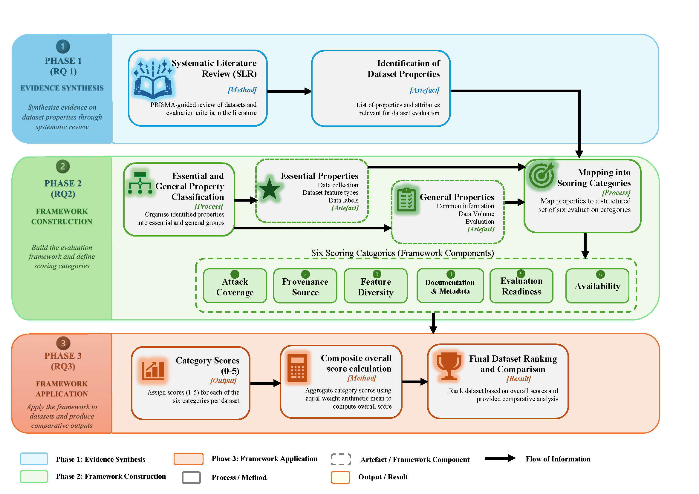

# Dataset_Score

This repository contains the code and descriptor tables used to operationalise a PRISMA-guided, property-based scoring framework for cybersecurity threat datasets. It generates (i) a scored table of datasets across six categories and (ii) the plots used for comparative visualisation (heatmap, category line chart, radar chart, and overall bar chart).

## Overview
This repository implements a PRISMA-guided, property-based scoring framework for evaluating cybersecurity threat datasets. The framework converts dataset descriptors into category-level scores and an overall quality score, enabling systematic comparison between datasets.

The repository also provides visualisation tools to generate:
- Heatmaps
- Category comparison line charts
- Radar charts
- Overall ranking charts
 ## Repository contents (key artifacts)
- `Full_Dataset_Revised_V2.csv`  
  Primary dataset descriptor table (property coding inputs used by the scoring pipeline).
- `Table_Overall_Ranking.csv`  
  Generated output table containing category scores and the overall mean score (0–5).
- `Datasetscoring.ipynb` and 'Dataset_Evaluation.ipynb'
  Executable notebooks implementing scoring and figure generation.
- `Final_Version/`  
  Folder containing the final workflow version.

<h2>Framework Workflow</h2>
<p align="center">

<em>Figure: PRISMA-guided dataset scoring workflow.</em>
</p>


## Reproducibility and environment
- **Python:** 3.10+ recommended  
- **Dependencies:** listed in `requirements.txt`  
- **Operating system:** platform-independent (tested with standard scientific Python stack)

## Contributions
This repository contributes:
- A structured dataset evaluation framework.
- A reproducible cybersecurity dataset scoring pipeline.
- Automated score aggregation and ranking.
- Multiple visualisation methods for comparative analysis.

## Quickstart (minimal reproduction)
1. Clone the repository:
   ```bash
   git clone https://github.com/uweaminur/Dataset_Score.git
   cd Dataset_Score
